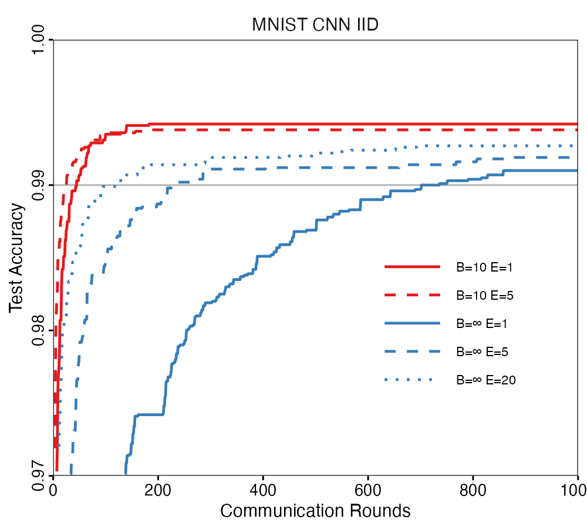
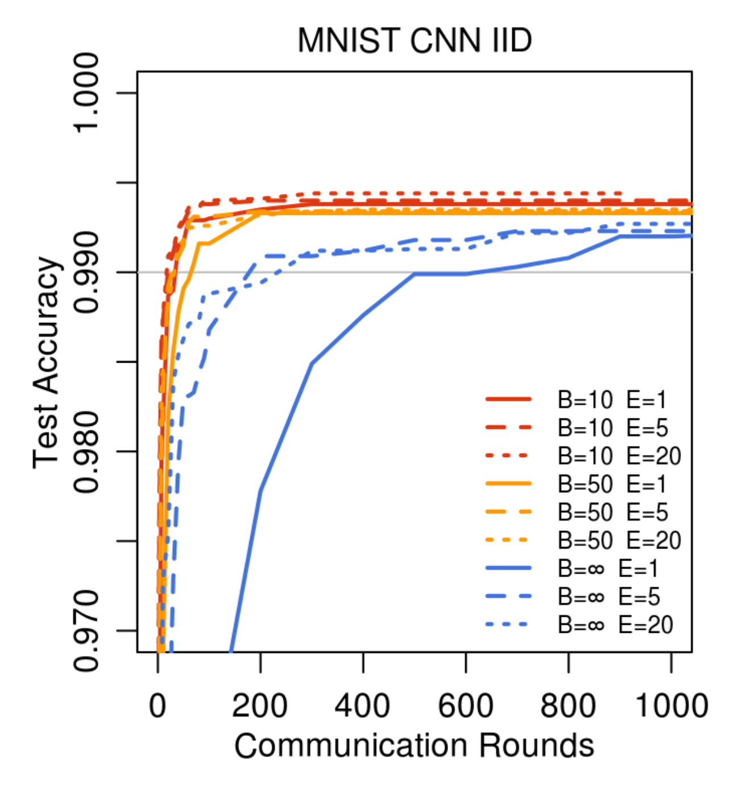

# FLfedavgR: Federated Learning with Federated Averaging in R

An implementation of **Federated Learning (FL)** using the **Federated Averaging (FedAvg)** algorithm in R using `torch`.

This package serves two purposes:
1.  **General Framework**: A flexible simulation framework (`fedavg_simulation` and `fedavg`) to run Federated Learning with Federated Averaging on your own datasets and models.
2.  **Paper Reproduction**: Example scripts and outputs for reproducing experiments from McMahan et al. (2017) on MNIST and CIFAR-10 datasets.
3. **GenAI Tool Usage Framework**: A general framework for using GenAI tools to generate the code for creating this R package.

## 📦 Installation

### From GitHub
```r
# Install devtools if you haven't already
install.packages("devtools")
# Install fedavgR from GitHub
devtools::install_github("juliana4850/FLfedavgR")
```

## 🚀 General Usage

You can use `fedavgR` to run federated learning simulations on your own data.

### 1. Using the Generic Framework

Use `fedavg_simulation()` to run FedAvg with custom models and datasets.

```r
library(fedavgR)
library(torch)

# 1. Define your model generator
model_gen <- function() {
  nn_sequential(
    nn_linear(10, 20),
    nn_relu(),
    nn_linear(20, 1)
  )
}

# 2. Prepare client datasets (list of torch datasets)
# Example: 10 clients with random data
clients <- lapply(1:10, function(i) {
  tensor_dataset(torch_randn(100, 10), torch_randn(100, 1))
})

# 3. Define evaluation function
eval_fn <- function(model, device) {
  model$eval()
  # ... compute metrics ...
  list(loss = 0.5) # Return named list
}

# 4. Run Simulation
results <- fedavg_simulation(
  client_datasets = clients,
  model_generator = model_gen,
  evaluation_fn = eval_fn,
  rounds = 50,
  C = 0.1,    # Select 10% of clients per round
  E = 5,      # 5 local epochs
  batch_size = 32
)

print(results$history)
```

## 📊 Paper Reproduction

> **⚠️ Important**: To run the paper reproduction tutorials, you must **clone this repository**. The tutorials are not intended to be rerun from the installed package.

### Setup for Paper Reproduction

```bash
# Clone the repository
git clone https://github.com/juliana4850/FLfedavgR.git
cd FLfedavgR

# Install the package in development mode
R -e "devtools::install_local('.', force = TRUE)"
```

**Note**: Please refer to `inst/reproduction_outputs/README.md` for full details on the paper reproduction experiments. Below, we provide a quick example of outputs for the MNIST CNN experiments reproduction.

### 📊 Example Outputs

**Note**: Due to randomization in the data partitioning and model training process, the exact outputs WILL vary from the paper and between runs. These example outputs are provided for reference.

Example results are saved to `inst/reproduction_outputs/`:
*   **`metrics_mnist_cnn.csv`**: Raw logs of every round (accuracy, loss, etc.).
*   **`figure2_reproduction_IID.png`**: Plot comparing FedAvg vs FedSGD for IID partition.

### Figure 2: Test Set Accuracy vs Communication Rounds for MNIST CNN (IID)

<table>
  <tr>
    <td></td>
    <td></td>
  </tr>
  <tr>
    <td align="center"><em>Example reproduction of Figure 2</em></td>
    <td align="center"><em>McMahan et al. (2017) Figure 2</em></td>
  </tr>
</table>

### Table 2: Communication Rounds to 99% Test Accuracy

Example Reproduction vs McMahan et al. (2017)

|  CNN   | E  | B  |  u  |    IID (Reproduction)     | IID (McMahan et al. (2017)) |
|:------:|:--:|:--:|:---:|:----------:|:-------:|
| FedSGD | 1  | ∞  | 1 |    702     |   626    |
| FedAvg | 5  | ∞  | 5 | 230 (3.1×) |   179 (3.5x)    |
| FedAvg | 20 | ∞  | 20 | 128 (5.5×) |   234 (2.7x)    |
| FedAvg | 1  | 10 | 60 | 45 (15.6×) |   34 (18.4x)    |
| FedAvg | 5  | 10 | 300 | 26 (27.0×) |    20 (31.3x)     |


**Note**: Values show rounds to target (speedup vs FedSGD baseline).

## 📁 Repository Structure

```
fedavgR/
├── R/                          # Core package code
│   ├── fedavg_simulation.R    # Generic FL with FedAvg framework
│   ├── fedavg.R               # Core aggregation function
│   ├── client_train.R         # Generic client training
│   ├── partitions.R           # Generic data partitioning utilities
│   ├── data_helpers.R         # Generic data helper functions
│   ├── parameters.R           # Generic parameter helper functions
│   ├── utils.R                # Generic utilities
│   └── ...
├── inst/
│   ├── tutorials/             # Demonstration reproduction scripts
│   │   ├── demo_mnist_cnn.R              # MNIST CNN reproduction
│   │   ├── demo_cifar10.R                # CIFAR-10 reproduction
│   │   ├── generate_figure2_from_logs.R  # Figure 2 plot generation
│   │   ├── generate_table2_from_logs.R   # Table 2 generation
│   │   └── mnist_helpers/                # MNIST-specific helper functions
│   │       ├── mnist_data.R              # Data loading
│   │       ├── mnist_models.R            # Model architectures
│   │       ├── mnist_training.R          # Training functions
│   │       ├── mnist_fedavg.R            # FedAvg wrapper
│   │       ├── mnist_partitions.R        # Data partitioning
│   │       ├── mnist_plotting.R          # Plotting utilities
│   │       ├── mnist_logging.R           # Logging utilities
│   │       └── README.md                 # MNIST-specific helper functions README
│   └── reproduction_outputs/  # Example reproduction results
│       ├── metrics_mnist_cnn.csv         # Example MNIST metrics
│       ├── metrics_cifar10.csv           # Example CIFAR-10 metrics
│       ├── figure2_reproduction_*.png    # Example Figure 2 plots
│       ├── table2_reproduction.*         # Example Table 2
│       ├── cifar10_final_model.pt        # Example saved model
│       └── README.md                     # Reproduction README
└── README.md                             # Package README
```

## 📚 Reference

McMahan, H. B., Moore, E., Ramage, D., Hampson, S., & y Arcas, B. A. (2017).
[Communication-Efficient Learning of Deep Networks from Decentralized Data](https://arxiv.org/abs/1602.05629).
*Proceedings of the 20th International Conference on Artificial Intelligence and Statistics (AISTATS)*.

## License

MIT License
