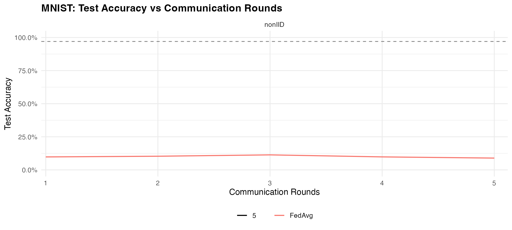
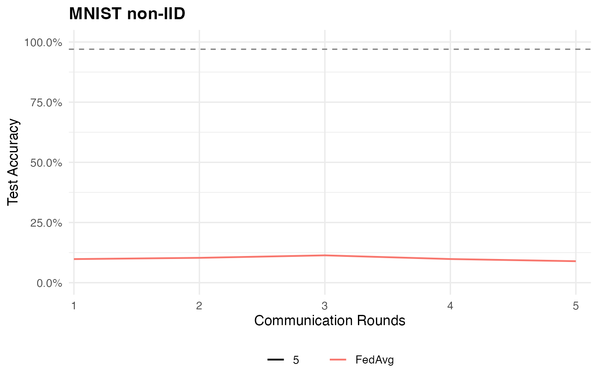

# fedavgR: Federated Averaging in R

A robust implementation of the **Federated Averaging (FedAvg)** algorithm in R using `torch`.

This package serves two purposes:
1.  **Paper Reproduction**: Exact reproduction of experiments from McMahan et al. (2017) on MNIST (IID and Non-IID).
2.  **General Framework**: A flexible simulation framework (`fedavg_simulation`) to run FedAvg on your own datasets and models.

## 📦 Installation

This package requires `torch` and `torchvision`.

```r
# Install dependencies
install.packages(c("torch", "torchvision", "devtools", "ggplot2", "dplyr", "readr", "tidyr"))
torch::install_torch()

# Install fedavgR
devtools::install()
```

## 🔬 Paper Reproduction (McMahan et al. 2017)

Reproduce the key results (Figure 2 and Table 2) from the original FedAvg paper.

### 1. CNN Experiments (Figure 2 & Table 2)
Reproduces the CNN convergence results on MNIST.

```bash
# Quick Mode (~2 hours): 1000 rounds, subset of configs
FEDAVGR_QUICK=1 Rscript inst/tutorials/paper_reproduction_cnn.R

# Full Mode (~7.5 hours): 1000 rounds, all configs
Rscript inst/tutorials/paper_reproduction_cnn.R
```

The CNN architecture is detailed in the paper and used to create the **Federated Averaging MNIST** baseline.

| Layer | Details|
| ----- | ------ |
| 1 | Conv2D(1, 32, 5, 1, 1) <br/> ReLU, MaxPool2D(2, 2, 1)  |
| 2 | Conv2D(32, 64, 5, 1, 1) <br/> ReLU, MaxPool2D(2, 2, 1) |
| 3 | FC(64 * 7 * 7, 512) <br/> ReLU |
| 5 | FC(512, 10) |

### 2. 2NN Experiments (MLP)
Reproduces the 2NN (Multilayer Perceptron) results.

```bash
Rscript inst/tutorials/paper_reproduction_2nn.R
```

**Outputs** are saved to `docs/examples/`.

<div align="center">
  <br>
  <em>Figure 1: MNIST (IID)</em>
</div>

<div align="center">
  <br>
  <em>Figure 2: MNIST (non-IID)</em>
</div>


## 🚀 General Usage

You can use `fedavgR` to run federated learning simulations on your own data.

### 1. Using the Generic Framework

Use `fedavg_simulation()` to run FedAvg with custom models and datasets.

```r
library(fedavgR)
library(torch)

# 1. Define your model generator
model_gen <- function() {
  nn_sequential(
    nn_linear(10, 20),
    nn_relu(),
    nn_linear(20, 1)
  )
}

# 2. Prepare client datasets (list of torch datasets)
# Example: 10 clients with random data
clients <- lapply(1:10, function(i) {
  tensor_dataset(torch_randn(100, 10), torch_randn(100, 1))
})

# 3. Define evaluation function
eval_fn <- function(model, device) {
  model$eval()
  # ... compute metrics ...
  list(loss = 0.5) # Return named list
}

# 4. Run Simulation
results <- fedavg_simulation(
  client_datasets = clients,
  model_generator = model_gen,
  evaluation_fn = eval_fn,
  rounds = 50,
  C = 0.1,    # Select 10% of clients per round
  E = 5,      # 5 local epochs
  batch_size = 32
)

print(results$history)
```

### 2. Using the MNIST Wrapper

For quick experiments on MNIST, use the built-in wrapper:

```r
# Load Data
ds_train <- mnist_ds(root = "data", train = TRUE, download = TRUE)
ds_test <- mnist_ds(root = "data", train = FALSE, download = TRUE)
labels <- mnist_labels(ds_train)

# Run FedAvg
res <- run_fedavg_mnist(
  ds_train = ds_train,
  ds_test = ds_test,
  labels_train = labels,
  model_fn = "cnn",       # "cnn" or "2nn"
  partition = "nonIID",   # "IID" or "nonIID"
  K = 100,                # Total clients
  C = 0.1,                # Fraction selected (0.1 = 10 clients)
  E = 5,                  # Local epochs
  batch_size = 50,        # Local batch size (Inf for FedSGD)
  lr_grid = c(0.01, 0.05, 0.1), # LR selection grid
  rounds = 100
)
```

## 📊 Features

-   **Flexible Architecture**: Plug in any `torch` model and dataset.
-   **Partitioning**: Built-in IID and Non-IID (shards) partitioners for MNIST.
-   **Aggregation**: Standard FedAvg weighted aggregation.
-   **Experiment Tracking**: Logs accuracy, loss, and parameters per round.
-   **Reproducibility**: Seed control for deterministic runs.

## 📚 Reference

McMahan, H. B., Moore, E., Ramage, D., Hampson, S., & y Arcas, B. A. (2017).
[Communication-Efficient Learning of Deep Networks from Decentralized Data](https://arxiv.org/abs/1602.05629).
*Proceedings of the 20th International Conference on Artificial Intelligence and Statistics (AISTATS)*.

## License

MIT License
