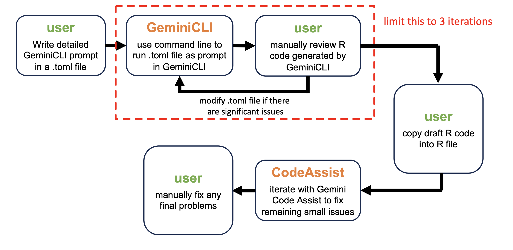
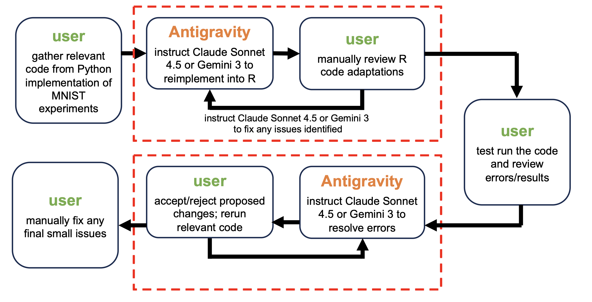

# GenAI Tutorial: How I Used AI Tools to Help Create This Project

This document is based on my experience using generative AI tools (e.g., GeminiCLI, Claude) to help create an R implementation of Federated Learning (FL) with Federated Averaging (FedAvg), as well as to reproduce the MNIST and CIFAR-10 experiments from the original McMahan et al. (2017) paper. 

Below, I specify the AI tools I used, provide example workflows and prompts/outputs generated during this project, and finally summarize what I learned from this experience with general advice for how to use generative AI tools to recreate or extend code similar to this project.

### Table of Contents
 1. AI Tools Used
 2. Workflows and Examples
 3. General Takeaways

---
## 1. AI Tools Used

This AI-first project unfolded in two overlapping components, both of which were supported by generative AI tools:

1.  I worked with GeminiCLI 2.5 via the VS Code IDE to implement a basic FL with FedAvg algorithm (in additional to several helper functions) in R. I also consulted Gemini Code Assist and ChatGPT 5 for additional help with debugging and testing.

2. I worked with Claude Sonnet 4.5 and Gemini 3 via the Antigravity IDE to implement reproduction scripts for the MNIST and CIFAR-10 experiments from the original McMahan et al. (2017) paper in R. I also consulted Gemini Code Assist and ChatGPT 5 for additional help with debugging and testing.

---

## 2. Workflows and Examples

> **Warning**: The workflows and examples provided in this section are for reference/educational purposes only. Rerunning any of the prompts I used below is NOT guaranteed to produce an identical output.

### i. Implementing FL with FedAvg

      

### ii. Reproducing the MNIST and CIFAR-10 experiments 

      

### Additional References
- A selection of additional prompts and GenAI tool responses from this project can be referenced in `docs/claude-log/` (Claude Sonnet 4.5) and `docs/gemini-log/` (Gemini CLI 2.5).

---

## 3. General Takeaways

### Know Before You Ask
- Know the exact output you want (function, script, test) and clearly state constraints (e.g., CPU-only, no extra prose, print code only).
- If relevant, review any prior prompts/responses or docs to recall established constraints (e.g., what prompt language worked, what didn't).
- If relevant, copy over minimal reference snippets (file paths + key functions) for context instead of whole files to keep prompts focused (e.g., don't copy over the entire file if you only need to debug a single function).

### Crafting Effective Prompts (for Major Components)
- State the goal, constraints, and allowed actions explicitly.
- Provide short, relevant code snippets and the desired output or code behavior.
- Ask for deterministic outputs: prefer functions with fixed seeds.
- Example prompt shape:
  - Goal: “Write an R function `foo(x, y)` that does …”
  - Constraints: “No extra dependencies; offline; CPU-only runtime; handle batch_size=Inf.”
  - Inputs: “Current helpers: parameter flatten/unflatten utilities already exist.”
  - Output format: “Return a single fenced code block; no extra prose.”

### Reviewing AI Output (this can be a bit of a trial and error process)
- Compare the AI output with your prompt instructions to ensure consistency with requested output.
- Check function or code block input/output formats to ensure consistency and compatibility with established code/functions.
- Check for nondeterministic behavior (random seeds, shuffling) and verify it is what you wanted. Enforce seeds when needed.
- When implementing a provided algorithm from a paper, carefully verify math and check edge cases.
- Ensure any additional logging formats match the schemas you already rely on.
- Paste proposed code into a new file or review line-edits one-by-one (don't blindly allow GenAI tools to overwrite existing files).
- Keep track of GenAI tool responses by saving prompt/response pairs so others can follow your changes.

### When to Re-Prompt or Follow-Up
- If the AI output omits or misinterprets a significant component or function/algorithm logic.
- If the AI output is difficult to implement or understand.
- If suggested code changes conflict with earlier validated settings.
- If there are any obvious non-trivial errors or typos.

### Best Practices (Tips & Tricks)
- Be explicit about what the AI tool is not allowed to do (e.g., “no deletion of files”).
- Break down the task into smaller increments; integrate and test run after each new file or change to avoid overwriting existing functionality.
- Keep records: store the prompt and the accepted response alongside the code change for future reproducibility.

## 📚 Reference

McMahan, H. B., Moore, E., Ramage, D., Hampson, S., & y Arcas, B. A. (2017).
[Communication-Efficient Learning of Deep Networks from Decentralized Data](https://arxiv.org/abs/1602.05629).
*Proceedings of the 20th International Conference on Artificial Intelligence and Statistics (AISTATS)*.
