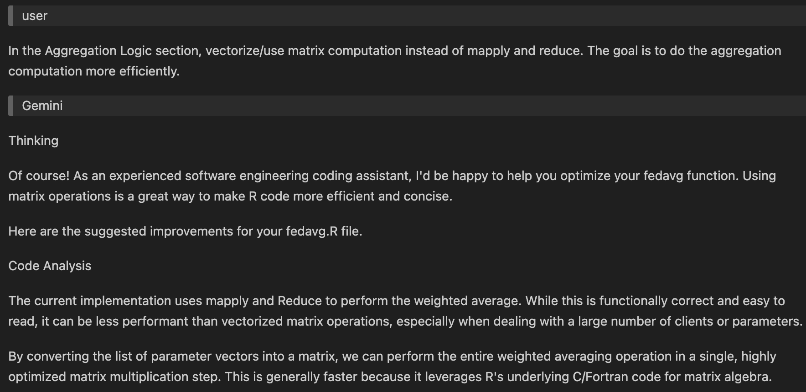
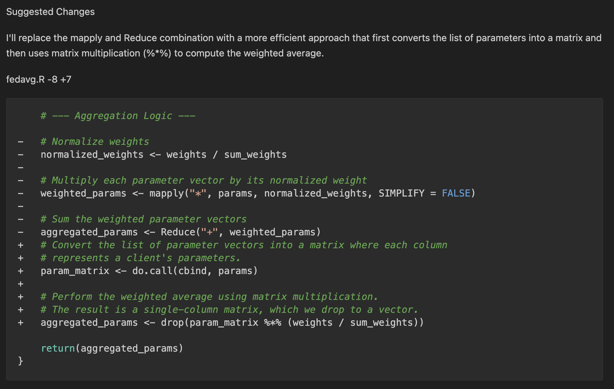
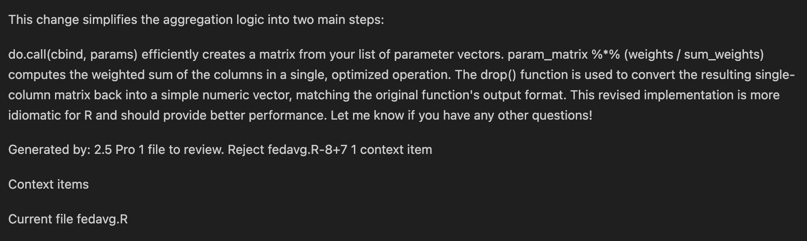

# GenAI Tutorial: How I Used AI Tools to Help Create This Project

This document is based on my experience using generative AI tools (e.g., GeminiCLI, Claude) to help create an R implementation of Federated Learning (FL) with Federated Averaging (FedAvg), as well as to reproduce the MNIST and CIFAR-10 experiments from the original McMahan et al. (2017) paper. 

Below, I specify the AI tools I used, provide example workflows and prompts/outputs generated during this project, and finally summarize what I learned from this experience with general advice for how to use generative AI tools to recreate or extend code similar to this project.

### Table of Contents
 1. AI Tools Used
 2. Workflows and Examples
 3. General Takeaways

---
## 1. AI Tools Used

This AI-first project unfolded in two overlapping components, both of which were supported by generative AI tools:

1.  I worked with GeminiCLI 2.5 via the VS Code IDE to implement a basic FL with FedAvg algorithm (in additional to several helper functions) in R. I also consulted Gemini Code Assist and ChatGPT 5 for additional help with debugging and testing.

2. I worked with Claude Sonnet 4.5 and Gemini 3 via the Antigravity IDE to implement reproduction scripts for the MNIST and CIFAR-10 experiments from the original McMahan et al. (2017) paper in R. I also consulted Gemini Code Assist and ChatGPT 5 for additional help with debugging and testing.

---

## 2. Workflows and Examples

> **Warning**: The workflows and examples provided in this section are for reference/educational purposes only. Rerunning any of the prompts I used below is NOT guaranteed to produce an identical output.

### i. Implementing FL with FedAvg

As a complete beginner to R package creation, I used GeminiCLI 2.5 via the VS Code IDE to scaffold the `fedavgR` package and draft the general use R functions contained in the package (e.g., `fedavg()`, `fedavg_simulation()`, `client_train_generic()`, `sample_clients()`, etc.).

> **Warning**: My initial interactions with GeminiCLI 2.5 were both very confusing and not successful. I would type broad requests directly into the GeminiCLI 2.5 interface, and it would run shell commands and generate multiple files with content that I didn't fully understand the purpose of. Then, completely overwhelmed by the amount of files/code generated, I would manually remove everything it generated, restart my GeminiCLI 2.5 session, and try again. These early interactions were mostly informative on what not to do for me, and the main takeaway here is that I would not recommend letting GeminiCLI 2.5 take full control of a big task unless you're REALLY confident you'll be able to follow the output and make sense of it. I definitely was not.

Thus, after a lot of trial and error, I ultimately used the following GeminiCLI prompt (reproduced in full from [`docs/gemini-log/001-prompt.md`](https://github.com/juliana4850/FLfedavgR/blob/af2913920580b8023ac2f899fb0fd927f8ddcb5c/docs/gemini-log/001-prompt.md)) to scaffold the R package:

```
You are an R project initializer. In this repository, output ONLY shell commands and R console commands 
(each prefixed with $ for shell or > for R) to:
1) create an R package skeleton (name: fedavgR),
2) initialize renv,
3) add testthat + roxygen2 + devtools,
4) create DESCRIPTION (Title: "Federating Learning with FedAvg in R", License: MIT + file LICENSE),
5) create a .gitignore for R + renv + docs,
6) create README.md with sections: Overview, Install, Quickstart, Reproducibility, GenAI Usage Instructions.

Constraints:
- Do not execute anything yourself—just write the commands.
- Keep the output as a sequence of commands I can copy/paste.
```

 - The most important parts to observe in the prompt above are the constraints preventing direct execution and instead asking for commands I can copy/paste. This was extremely important for me since I had absolutely no experience with R package creation and did not want GeminiCLI to execute a bunch of commands and create files on my behalf.
 - By constraining the output to be a sequence of commands I could copy/paste, I was able to work through the creation process step-by-step, learning what was happening/being created at each step.

GeminiCLI 2.5 generated an output, which can be viewed in full here: [`fedavgR/docs/gemini-log/001-response.md`](https://github.com/juliana4850/FLfedavgR/blob/af2913920580b8023ac2f899fb0fd927f8ddcb5c/docs/gemini-log/001-response.md) 

> NOTE: comments with prefix 'tuj:' were added by me afterwards to help me remember what I did.

For example, here is the second command from within the above referenced GeminiCLI output, which creates the populated `DESCRIPTION` file:

```bash
$ usethis::use_description(list(
    Package = "fedavgR",
    Title = "Federating Learning with FedAvg in R",
    `Authors@R` = 'person("First", "Last", email = "first.last@example.com", role = c("aut", "cre"))',
    Description = "Implements the Federated Averaging (FedAvg) algorithm for privacy-preserving, decentralized model training in R.",
    License = "MIT + file LICENSE"
  ))
```
 Because I was manually executing each command, I was also able to verify it contained the correct information AND that it was working as expected. 
 - So in the simple example above, I was able to revise the above command to replace the placeholder "First", "Last", "first.last@example.com" with my actual name and email, as well as revise the other description fields to be more accurate. Then, after running, I could open the DESCRIPTION file to verify it was created correctly before proceeding to the next step.

After proceeding through that entire initialization workflow, I was able to successfully create the R package skeleton and move on to the next step: writing my `fedavgR` package's core functions.

For each of the core functions (`client_train_generic()`, `data_subset()`, `fedavg_simulation()`, `fedavg()`, `sample_clients()`, `rounds_to_target()`, and few generic data and parameter helper functions), I used the following GenAI-first workflow to draft and edit the code:

<p align="center">
      
</p>

For example, to write the `fedavg()` function, I began by drafting a prompt for GeminiCLI that described the FedAvg algorithm from the paper. Then, I used ChatGPT 5 to copy-edit the prompt language and formatting, ran the revised prompt through GeminiCLI, reviewed the output, and then manually edited the prompt to add additional requirements and constraints (for example, "no extra prose" to prevent GeminiCLI from generating extremely long outputs). I repeated this process until I was satisfied that the output contained all the parts I wanted.

> **NOTE:** Important lesson learned here: It was extremely difficult for me to get GeminiCLI to produce a perfect working output. Oftentimes, the best path forward is to move on to targeted debugging and in-line edits. Eventually, the bar for a "good enough" output from GeminiCLI for me was essentially a structurally correct R function code block.

Here is the GeminiCLI prompt I used to draft the `fedavg()` function:

```
Scaffold an R function for a federated learning package.

Function name: fedavg
Goal: server-side FedAvg aggregation per McMahan et al.:
w_{t+1} = sum_k (n_k / sum_j n_j) * w_{t+1}^k
i.e., a sample-size–weighted average of client parameter vectors.

Requirements:
- File: R/fedavg.R with roxygen2 docs (@export) and thorough input checks:
  * params: list of numeric vectors of equal length; finite; no NA.
  * weights: numeric, same length as params; nonnegative; sum(weights) > 0.
- Behavior:
  * Return numeric vector: the weighted average of params with weights normalized by their sum.
  * If any check fails, stop() with a clear message.
- Include a basic example in docs.
- File: tests/testthat/test-fedavg.R with at least 5 tests:
  1) Weighted mean correctness versus manual sum.
  2) Invariance to client order (permuting lists/weights gives same result).
  3) Deterministic under set.seed (no RNG used; same output twice).
  4) Error on unequal param lengths.
  5) Error on zero-sum or negative weights. Error on NA.

Output exactly two fenced code blocks:
(1) full content for R/fedavg.R
(2) full content for tests/testthat/test-fedavg.R
No extra prose.
```
A copy of the full GeminiCLI 2.5 output for the above prompt can be viewed in full here: [`fedavgR/docs/gemini-log/002-response.md`](https://github.com/juliana4850/FLfedavgR/blob/af2913920580b8023ac2f899fb0fd927f8ddcb5c/docs/gemini-log/002-response.md)
 - Observe once again that the output is a series of code blocks that I can review, edit, copy, and paste into the appropriate files.

Next, as shown in the workflow diagram above, I copied the relevant code blocks into a new R file to create the first draft of `R/fedavg.R`:
```r
#' Federated Averaging (FedAvg)
#'
#' @description
#' Aggregates client model parameters using the Federated Averaging algorithm
#' as described by McMahan et al. (2017). The aggregation is a weighted
#' average of the client parameters, where the weights are typically the
#' number of samples on each client.
#'
#' The formula is: `w_{t+1} = sum_k (n_k / sum_j n_j) * w_{t+1}^k`
#'
#' @param params A list of numeric vectors. Each vector represents the model
#'   parameters from a single client.
#' @param weights A numeric vector of non-negative weights (e.g., number of
#'   samples `n_k`) corresponding to each client in `params`.
#'
#' @return A numeric vector representing the aggregated model parameters (`w_{t+1}`).
#'
#' @references
#' McMahan, B., Moore, E., Ramage, D., Hampson, S., & y Arcas, B. A. (2017).
#' Communication-Efficient Learning of Deep Networks from Decentralized Data.
#' *Proceedings of the 20th International Conference on Artificial Intelligence
#' and Statistics (AISTATS)*.
#'
#' @export
#'
#' @examples
#' # Example with two clients
#' client1_params <- c(0.1, 0.2, 0.3)
#' client2_params <- c(0.4, 0.5, 0.6)
#' client_params <- list(client1_params, client2_params)
#'
#' # Weights are the number of data samples on each client
#' client_samples <- c(100, 200)
#'
#' aggregated_params <- fedavg(client_params, client_samples)
#' print(aggregated_params)
#' # Expected: (100 * c(0.1, 0.2, 0.3) + 200 * c(0.4, 0.5, 0.6)) / 300
#'
fedavg <- function(params, weights) {
  # --- Input Validation ---

  # Validate `params`
  if (!is.list(params)) {
    stop("Input 'params' must be a list of numeric vectors.")
  }
  if (length(params) == 0) {
    stop("Input 'params' list cannot be empty.")
  }
  if (!all(sapply(params, is.numeric))) {
    stop("All elements in 'params' must be numeric vectors.")
  }
  param_lengths <- sapply(params, length)
  if (length(unique(param_lengths)) > 1) {
    stop("All parameter vectors in 'params' must have the same length.")
  }
  if (any(sapply(params, function(p) any(!is.finite(p))))) {
    stop("Parameter vectors cannot contain NA, NaN, Inf, or -Inf values.")
  }

  # Validate `weights`
  if (!is.numeric(weights)) {
    stop("Input 'weights' must be a numeric vector.")
  }
  if (length(params) != length(weights)) {
    stop("Length of 'params' and 'weights' must be equal.")
  }
  if (any(is.na(weights))) {
    stop("Weights cannot contain NA values.")
  }
  if (any(weights < 0)) {
    stop("Weights must be non-negative.")
  }
  sum_weights <- sum(weights)
  if (sum_weights <= 0) {
    stop("The sum of weights must be greater than zero.")
  }

  # --- Aggregation Logic ---

  # Normalize weights
  normalized_weights <- weights / sum_weights

  # Multiply each parameter vector by its normalized weight
  weighted_params <- mapply("*", params, normalized_weights, SIMPLIFY = FALSE)

  # Sum the weighted parameter vectors
  aggregated_params <- Reduce("+", weighted_params)

  return(aggregated_params)
}
```

Reviewing the output carefully line-by-line, I felt that there should be a more efficient implementation of the aggregation logic. I provided `R/fedavg.R` as a context file and asked Gemini Code Assist to help me optimize the aggregation logic section of the code:

<p align="center">
      
      
      
</p>

> A full textcopy of the full Gemini Code Assist interaction for the above issue can be viewed in full here: [`fedavgR/docs/gemini-log/003-chat.md`](https://github.com/juliana4850/FLfedavgR/blob/af2913920580b8023ac2f899fb0fd927f8ddcb5c/docs/gemini-log/003-chat.md)

With the assistance of Gemini Code Assist (as shown above), I was able to draft a working alternate matrix algebra implementation of the aggregation logic section of the code.

I then continued to iterate on the aggregation logic code until it was both correct and efficient to the best of my (GenAI tool assisted) ability, and the final production version of the [`fedavg()`](https://github.com/juliana4850/FLfedavgR/blob/af2913920580b8023ac2f899fb0fd927f8ddcb5c/R/fedavg.R) function (partial code reproduction below) contains that matrix algebra implementation in its aggregation logic:
```r
    # --- Aggregation Logic ---
    if (length(params) <= 32L) { # Use BLAS for up to ~32 clients
        # Fast path (BLAS)
        # Convert the list of parameter vectors into a matrix where each column
        # represents a client's parameters.
        # Perform the weighted average using matrix multiplication.
        # The result is a single-column matrix, which we drop to a vector.
        param_matrix <- do.call(cbind, params)
        normalized <- weights / sum_weights
        return(unname(drop(param_matrix %*% normalized)))
    } else {
        # Streaming (low-memory) path
        accum <- params[[1]] * weights[1]
        for (i in 2:length(params)) {
            accum <- accum + (params[[i]] * weights[i])
        }
        return(unname(as.numeric(accum / sum_weights)))
    }
```

**In summary, the above `fedavg()` function in `R/fedavg.R` example illustrates how I used my GenAI-first approach to draft, edit, and debug production-ready functions for my `fedavgR` package.**

#### Additional References
- A selection of additional prompts and GeminiCLI and Gemini Code Assist responses from this project can be found in [`docs/gemini-log/`](https://github.com/juliana4850/FLfedavgR/tree/af2913920580b8023ac2f899fb0fd927f8ddcb5c/docs/gemini-log).

### ii. Reproducing the MNIST and CIFAR-10 experiments 

<p align="center">
      
</p>


### Additional References
- A selection of additional prompts and GenAI tool responses from this project can be referenced in `docs/claude-log/` (Claude Sonnet 4.5) and `docs/gemini-log/` (Gemini CLI 2.5).


---

## 3. General Takeaways

### Know Before You Ask
- Know the exact output you want (function, script, test) and clearly state constraints (e.g., CPU-only, no extra prose, print code only).
- If relevant, review any prior prompts/responses or docs to recall established constraints (e.g., what prompt language worked, what didn't).
- If relevant, copy over minimal reference snippets (file paths + key functions) for context instead of whole files to keep prompts focused (e.g., don't copy over the entire file if you only need to debug a single function).

### Crafting Effective Prompts (for Major Components)
- State the goal, constraints, and allowed actions explicitly.
- Provide short, relevant code snippets and the desired output or code behavior.
- Ask for deterministic outputs: prefer functions with fixed seeds.
- Example prompt shape:
  - Goal: “Write an R function `foo(x, y)` that does …”
  - Constraints: “No extra dependencies; offline; CPU-only runtime; handle batch_size=Inf.”
  - Inputs: “Current helpers: parameter flatten/unflatten utilities already exist.”
  - Output format: “Return a single fenced code block; no extra prose.”

### Reviewing AI Output (this can be a bit of a trial and error process)
- Compare the AI output with your prompt instructions to ensure consistency with requested output.
- Check function or code block input/output formats to ensure consistency and compatibility with established code/functions.
- Check for nondeterministic behavior (random seeds, shuffling) and verify it is what you wanted. Enforce seeds when needed.
- When implementing a provided algorithm from a paper, carefully verify math and check edge cases.
- Ensure any additional logging formats match the schemas you already rely on.
- Paste proposed code into a new file or review line-edits one-by-one (don't blindly allow GenAI tools to overwrite existing files).
- Keep track of GenAI tool responses by saving prompt/response pairs so others can follow your changes.

### When to Re-Prompt or Follow-Up
- If the AI output omits or misinterprets a significant component or function/algorithm logic.
- If the AI output is difficult to implement or understand.
- If suggested code changes conflict with earlier validated settings.
- If there are any obvious non-trivial errors or typos.

### Best Practices (Tips & Tricks)
- Be explicit about what the AI tool is not allowed to do (e.g., “no deletion of files”).
- Break down the task into smaller increments; integrate and test run after each new file or change to avoid overwriting existing functionality.
- Keep records: store the prompt and the accepted response alongside the code change for future reproducibility.

## 📚 Reference

McMahan, H. B., Moore, E., Ramage, D., Hampson, S., & y Arcas, B. A. (2017).
[Communication-Efficient Learning of Deep Networks from Decentralized Data](https://arxiv.org/abs/1602.05629).
*Proceedings of the 20th International Conference on Artificial Intelligence and Statistics (AISTATS)*.
